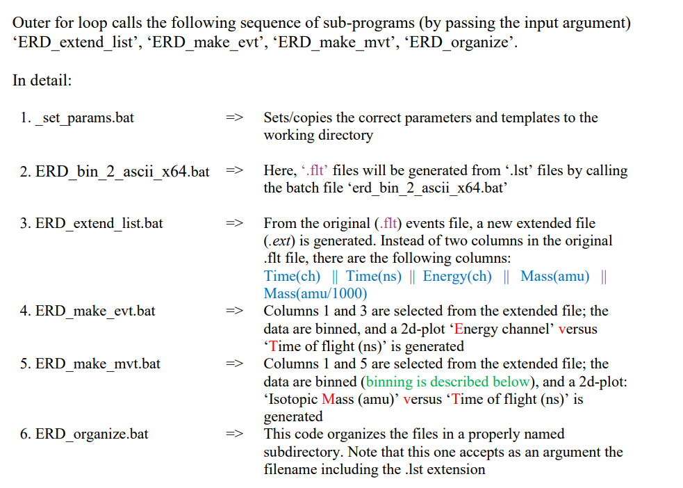

# pyPrepERD

## About

This project aims at making the analysis of Elastic Recoil Detection easiers.
It provides the analyst with a simple GUI.

The source code of this program can be found at `https://github.com/SimonMeersschaut/pyPrepERD`.

## Instalation

To install this program, open a terminal in the folder of the source code and run 
```
pip install -r requirements.txt
```
This will install all required dependancies.

After this, you can simply double click the shortcut file or run
```
python application.py
```
to run the application.

## Code Structure

It is advised to always run scripts from the root directory, that is from the folder `pyPrepERD/`.

Running the test suite can be done by running `pytest`.

We shortly go over the structure of the project.

- `/application.py`: this is the main python file when you are running the GUI.
- `/process.py`: this file defines what the server (called Denali) has to perform after a new measurement has been made.
That is, the process of converting binary data to plots and human readable data.
- `/gui/`: this folder defines the Graphical User Interface using Tkinter and Matplotlib.
- `/analysis/`: This folder contains functions to analyse the data, including functions to read and dump binary data.
- `/utils/` contains utilities like configurations, path data, polygon helper functions and rectangle helper functions 
- `/tests/`: the test suite of the entire project.

Herewith I provide a screenshot of how the previous program worked:



The working of this program is analog to the old one.

In the folder called `config`, one can find configuration files, such as;
- `Bparams.txt` which contains callibration parameters, used for conversion
- `config.yaml` which contains basic configurations about the program
- `Tof.in` which contains information about the lab

## Credits


Icons: https://www.flaticon.com/
